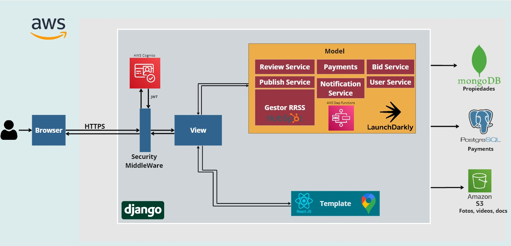
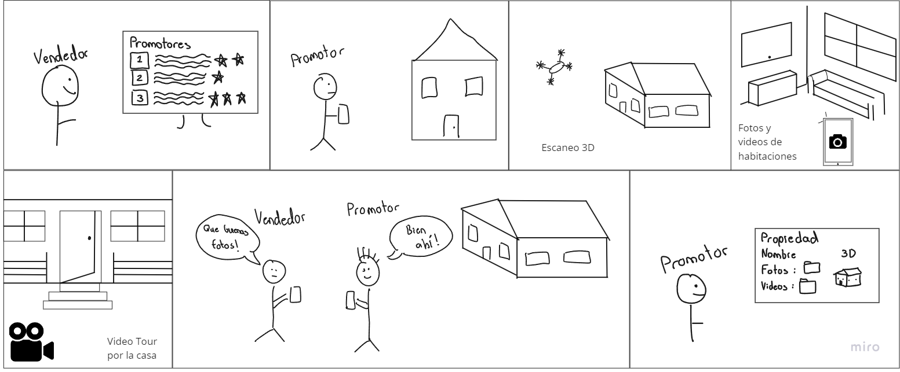
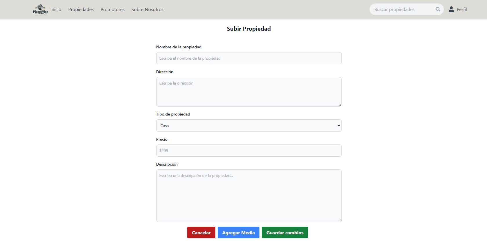
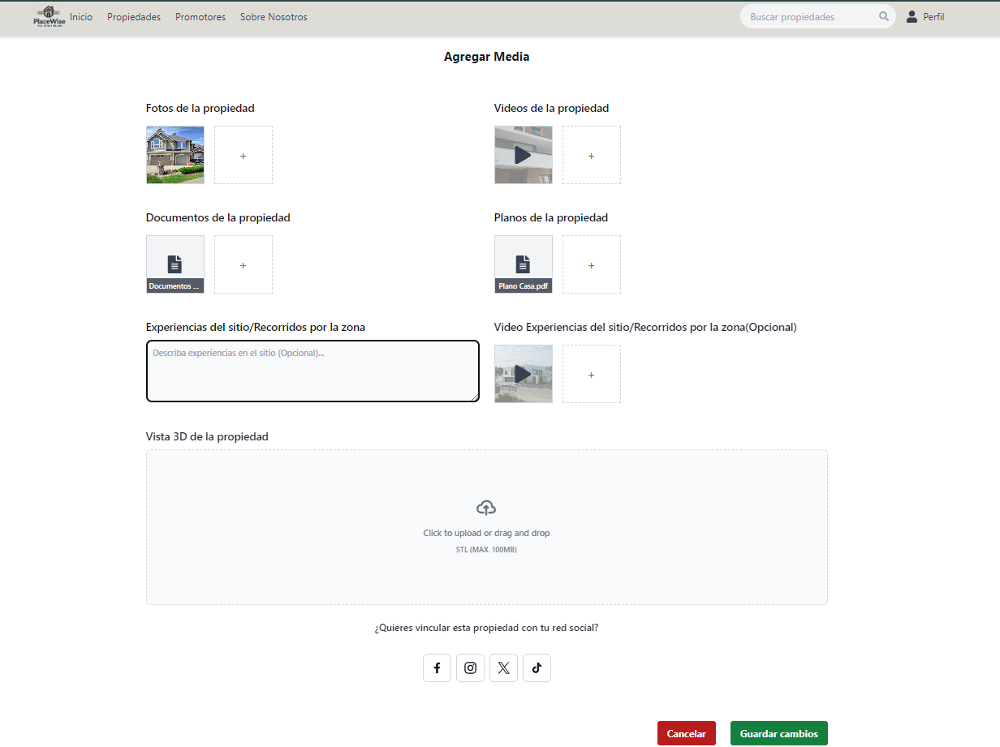

# PlaceWise

## Descripción del Proyecto
Plataforma web para la compra y venta de real estate que facilita los procesos al eliminar la necesidad buscar intermediarios con el objetivo de ahorrar costos y tiempo. Con un enfoque para la participación de usuarios que promocionen las propiedades. Dirigido a vendedores y compradores de propiedades.

## Requerimientos

### 1. Negociación
- Cálculo de comisiones **1**
- Reducciones legales **1**
- Escrow **1**
- Métodos de pago **1**
- Reservación - Iniciar contrato **2**
- Ofertas / contraofertas **2**
- Disolución de trato **2**

### 2. Propiedades
- Títulos legales **1**
- Agua y electricidad **1**
- Perfil de propiedad **1**

### 3. Notificaciones **2**

### 4. Promotores
- Perfil **1**
- Subir propiedad **1**
- Tarifas según equipo **2**
- Historial de envíos **2**
- Canales -> Integración con RRSS **2**
- Sistema de calificación **3**

### 5. Abogados
- Revisión de estado **3**
- Perfil **3**
- Tarifas **3**
- Subasta **3**

### 6. Compradores
- Perfil **1**
- Estatús **1**

### 7. Vendedores
- Perfil **1**
- Subir propiedad **1**
- Mantenimiento diario **1**
- Mantenimiento de promotor **1**
- Estatus **1**

### 8. Back Office
- Administración del sistema **1**
- Servicio al cliente **1**

### 9. Search
- Búsqueda por ubicación **1**
- Búsqueda en mapa **2**
- Búsquedas inteligentes **3**

## Arquitectura

## Definición del problema

### Problem Statement
Lograr mantener una alta eficiencia de subida y carga de archivos multimedia para la visualiación de propiedades.

### StoryBoard
 

## Requerimientos no funcionales

### Performance
1. What are the expected response times for different functions under normal and peak load conditions?

Para la consulta de propiedades, la información será almacenada en MongoDB, lo que permitirá un acceso rápido a los datos. Para la publicación de nuevas propiedades, el manejo de transacciones, registros e historial será con PostgreSQL para asegurar tiempos de respuesta eficientes. La gestión de usuarios estará respaldada por AWS Cognito para la autenticación y la gestión de tokens JWT. En condiciones normales el tiempo de respuesta tendría que ser menor a 1 segundo.

Cuando exista una alta demanda, como cuando con las subastas, el tiempo de respuesta podría subir a 2 o 3 segundos. Usando Amazon S3 para el almacenamiento de fotos y videos, y AWS Step Functions para coordinar flujos complejos de trabajo se garantiza que la carga se distribuya de manera eficiente en todo el sistema.

2. How many concurrent users should the system support?
  
El sistema debe estar preparado para soportar inicialmente entre 500 y 1000 usuarios concurrentes, asegurando que se pueda manejar un número significativo de usuarios interactuando con la plataforma al mismo tiempo. A medida que el sistema crezca, debe escalar para soportar hasta 5000 usuarios concurrentes durante eventos de alta demanda, como subastas. AWS Cognito proporcionará la autenticación y gestión de sesiones para estos usuarios de manera segura, mientras que Django junto con Amazon S3 manejará las solicitudes relacionadas con la visualización de imágenes y videos. Para la base de datos, tanto MongoDB (para propiedades) como PostgreSQL (para registros e historiales) garantizarán una gestión eficiente de los datos.

3. What are the performance benchmarks for critical operations?
   
Para la búsqueda de propiedades, que se realizará utilizando MongoDB, los resultados deberían retornar en menos de 1 segundo bajo condiciones normales y en menos de 2 segundos durante cargas máximas.
En cuanto al procesamiento de pagos, que estará respaldado por PostgreSQL, las transacciones deberán completarse en menos de 3 segundos para evitar tiempos de espera largos durante operaciones financieras.
Para la carga de imágenes y videos, que se almacenarán en Amazon S3, el tiempo de carga debería estar entre 2 y 5 segundos, dependiendo del tamaño de los archivos y de la conexión que tenga el cliente con el servidor.

Finalmente, la gestión de notificaciones a los usuarios será casi inmediata, utilizando LaunchDarkly para el control de funciones y HubSpot para la gestión de interacciones en redes sociales, con un tiempo cercano a 1 segundo para asegurar que los usuarios reciban información en tiempo real.

### Scalability

1. How should the system handle increased load or data volume over time?

El sistema podrá escalar tanto vertical como horizontalmente conforme aumente la carga de usuarios y el volumen de datos. En términos de datos, MongoDB para propiedades y PostgreSQL para pagos permitirán la expansión del almacenamiento, ya que ambos sistemas son capaces de distribuir los datos en múltiples nodos. Amazon S3, utilizado para almacenar fotos, videos y documentos, también es altamente escalable, permitiendo almacenar grandes cantidades de contenido multimedia sin comprometer el rendimiento. Asegurando, a medida que se agreguen más usuarios o propiedades, el sistema siga funcionando sin interrupciones ni tiempos de espera prolongados.

2. Are there any specific scalability requirements for different components of the system?

MongoDB debe ser capaz de escalar horizontalmente para manejar el creciente volumen de datos de propiedades, distribuyendo los datos en múltiples nodos a medida que aumente la cantidad de registros.
PostgreSQL para la gestión de pagos requiere alta disponibilidad y replicación para garantizar que las transacciones sean rápidas y seguras, incluso cuando el número de usuarios y transacciones crezca.
Amazon S3 para el almacenamiento de archivos multimedia (fotos, videos) garantiza que este componente pueda escalar sin problemas ya que S3 es prácticamente ilimitado en términos de capacidad de almacenamiento y se ajusta automáticamente según sea necesario.
AWS Cognito, que maneja la autenticación y emisión de tokens JWT, también deberá escalar para soportar más usuarios concurrentes.
Finalmente, AWS Step Functions debe ser capaz de manejar un mayor número de flujos de trabajo simultáneos, distribuyendo la carga de trabajo en varias instancias de los servicios backend a medida que el volumen de operaciones aumente, especialmente en el caso de subastas o notificaciones masivas.

### Reliability
What is the acceptable downtime for the system?

El tiempo de inactividad aceptable debe ser mínimo, ya que los usuarios esperan poder acceder al sistema en todo momento, especialmente en un entorno de bienes raíces donde las transacciones y consultas son sensibles al tiempo. Un 99.9% de tiempo de actividad sería el objetivo, lo que permite un máximo de menos de 9 horas de inactividad por año. 

1. How should the system handle failures and ensure data integrity?

El sistema va a estar diseñado para ser tolerante a fallos, implementando mecanismos de recuperación automática y asegurando que los datos no se corrompan. Con el uso de replicación de bases de datos tanto en MongoDB como en PostgreSQL, asegurara que haya copias de los datos en múltiples nodos, evitando la pérdida de información en caso de fallo en un servidor. 
Para el manejo de fallos en los servicios de backend, AWS Step Functions puede reintentar automáticamente las tareas fallidas o desviarlas a otras instancias, mientras que AWS Cognito asegura la continuidad en el manejo de sesiones y autenticaciones de usuarios sin interrupciones. En caso de fallos graves, Django y el middleware de seguridad deberían incluir un mecanismo de "circuit breaker" para redirigir temporalmente las solicitudes mientras se recuperan los servicios fallidos.

2. What are the backup and recovery procedures?

El sistema debe contar con procedimientos de respaldo automáticos y manuales. Amazon S3, ya incluye copias de seguridad automáticas con redundancia en varias zonas de disponibilidad. En cuanto a las bases de datos, MongoDB puede programar respaldos automáticos a intervalos regulares.
La restauración de datos deberá estar disponible en menos de 1 hora después de un incidente grave, utilizando instantáneas y respaldos almacenados en Amazon S3.

### Availability
1. What are the uptime requirements for the system?

El sistema debe garantizar un 99.9% de tiempo de actividad, lo que implica menos de 9 horas de inactividad al año. Esto es crítico para mantener una experiencia de usuario fluida, especialmente cuando se trata de transacciones de bienes raíces y pagos en línea. Para alcanzar este nivel de disponibilidad, es necesario implementar mecanismos de alta disponibilidad.
Además, se debe considerar la replicación de bases de datos en varias zonas de disponibilidad para garantizar que tanto los datos almacenados en MongoDB como en PostgreSQL estén siempre accesibles. Amazon S3 garantiza alta disponibilidad de la multimedia.

2. Are there specific times when the system must be available without fail?
3. 
Durante las subastas o eventos de venta especiales, el sistema debe estar disponible sin interrupciones para garantizar que los usuarios puedan participar y realizar transacciones en tiempo real.
Horarios comerciales y fines de semana, cuando es probable que la mayoría de los usuarios realicen búsquedas, consultas o pagos, el sistema debe estar disponible al 100%. 

### Security
1. What are the security requirements for data storage and transmission?

Todos los datos  como las propiedades almacenadas en MongoDB y los registros transaccionales gestionados a través de PostgreSQL, deben ser cifrados. Para la transmisión de datos entre los usuarios y el sistema, se debe utilizar HTTPS con certificados SSL/TLS para cifrar todas las comunicaciones y evitar que los datos sean interceptados o manipulados durante el tránsito.
Además, las fotos y videos almacenados en Amazon S3 deben estar protegidos mediante cifrado en reposo utilizando S3 Server-Side Encryption (SSE) o cifrado a nivel de cliente antes de subir los archivos al servidor. Todos los accesos a los recursos en el sistema deben estar controlados mediante políticas estrictas de acceso basado en roles, tanto a nivel de base de datos como de almacenamiento en la nube.

2. How should user authentication and authorization be managed?

Será manejado con AWS Cognito ya que ofrece un servicio seguro y escalable para gestionar la autenticación de usuarios mediante tokens JWT. Puede integrar proveedores de identidad externos como Google o Facebook, lo cual es beneficioso para la plataforma de PlaceWise donde los usuarios pueden preferir acceder usando sus cuentas sociales. Los tokens generados por Cognito deben tener una expiración temporal para reducir el riesgo de ataques de sesión.
En cuanto a la autorización, el sistema implementará un control de acceso basado en roles para asegurar que los usuarios solo puedan acceder a las funciones y datos que les están permitidos. Los administradores podrán gestionar propiedades y pagos, mientras que los usuarios normales solo podrán realizar búsquedas o ver sus propios pagos.

3. Are there any compliance requirements related to data security?

Dado que se manejarán datos personales y financieros, el sistema debe cumplir con normativas de protección de datos, como el Reglamento General de Protección de Datos (GDPR) de la Unión Europea y la Ley de Protección de Datos Personales en muchos países de América Latina. Esto implicara obtener el consentimiento explícito de los usuarios para el procesamiento de sus datos y garantizar el derecho de los usuarios a acceder, modificar o eliminar sus datos. 

### Usability
1. What are the usability standards for the user interface?

La interfaz de usuario (UI) debe ser intuitiva, fácil de navegar y visualmente atractiva, siguiendo principios de diseño centrados en el usuario. Debe ofrecer una experiencia fluida, minimizando el número de clics necesarios para realizar acciones clave, como buscar propiedades, hacer pagos o consultar detalles. El diseño debe seguir estándares, para garantizar una apariencia consistente y adaptada a diferentes tamaños de pantalla.

Además, el sistema debe ofrecer tiempos de carga rápidos y responder a las interacciones del usuario en menos de 1 segundo para la mayoría de las acciones cotidianas, como desplazarse por listados de propiedades. Las mejores prácticas incluyen el uso de feedback visual inmediato para indicar que una acción está en curso.

El uso de colores debe cumplir con pautas de accesibilidad para que los textos sean fácilmente legibles, y la disposición de los elementos debe ser coherente para que los usuarios no tengan que aprender a usar cada página desde cero.

2. How should the system accommodate users with disabilities?

    + Textos alternativos para imágenes de propiedades y otros contenidos visuales, para que los lectores de pantalla puedan describir lo que aparece.
    + Navegación por teclado para asegurar que todos los elementos interactivos puedan ser accesibles sin necesidad de usar un ratón.
    +  El sistema debe ofrecer la posibilidad de ajustar el tamaño de la fuente y el contraste de los colores, ayudando a personas con discapacidades visuales leves o moderadas.

3. Are there specific requirements for user training and documentation?

La documentación debe cubrir temas clave como:
Guías rápidas sobre cómo realizar las tareas más comunes, como buscar propiedades, hacer pagos o gestionar cuentas.
Videos tutoriales que muestren cómo usar la plataforma paso a paso, lo cual es útil para aquellos que prefieren aprender visualmente.
Preguntas frecuentes (FAQs) integradas directamente en la plataforma o disponibles en un portal de ayuda.
Para los administradores del sistema, se debe proporcionar documentación técnica detallada que cubra temas como la gestión de propiedades, la administración de usuarios y la configuración de pagos. Esto incluiría guías de solución de problemas comunes y prácticas recomendadas.
En términos de capacitación, para equipos grandes (como agencias de bienes raíces), se puede ofrecer una capacitación en línea o webinars que guíen a los usuarios a través del sistema.

### Maintainability
1. ow easy should it be to update and modify the system?

Las actualizaciones y modificaciones al sistema deben tener un tiempo de inactividad máximo de 30 minutos para cambios. El uso de Django como framework backend facilita las actualizaciones del código gracias a su arquitectura modular y soporte de migraciones de bases de datos. Para el frontend, la integración con React JS asegura que las modificaciones en la interfaz de usuario puedan realizarse sin afectar la lógica del servidor.
Las actualizaciones deben gestionarse mediante Continuous Integration/Continuous Deployment (CI/CD) lo que permitirá implementar cambios en el sistema de manera automática tras pasar las pruebas.
What are the requirements for logging and monitoring system performance?

El sistema debe contar con registro de eventos (logging) detallado y centralizado para todas las actividades críticas, incluyendo autenticación, transacciones de pago, consultas de propiedades y cambios de estado del sistema. Los registros deben ser almacenados en Amazon S3 con retención de datos durante al menos 1 año, cumpliendo con requisitos de auditoría y análisis de fallos.

2. How should the system handle version control and deployment?

El sistema debe utilizar Git para el control de versiones, almacenando el código fuente en un repositorio central. Todo el código debe estar versionado de manera que cada cambio quede documentado y rastreable. Para garantizar que los cambios en el código no interrumpan el funcionamiento, se debe implementar un flujo de trabajo basado en ramas, con ramas dedicadas para desarrollo, pruebas, y producción.
El despliegue debe ser gestionado mediante CI/CD asegurando que cada versión del sistema pase por pruebas automáticas antes de ser desplegada. 

### Interoperability
1. How should the system integrate with existing software and hardware?

El sistema debe integrarse fácilmente con otros sistemas de software y hardware mediante APIs RESTful. Django proporcionará estas APIs para interactuar con otros sistemas de terceros, como la integración con HubSpot para la gestión de redes sociales o con Google Maps para la visualización de propiedades en mapas. Las APIs deben estar documentadas utilizando Swagger/OpenAPI para asegurar que otros sistemas puedan consumirlas de manera clara y consistente.
A nivel de base de datos, el sistema debe poder sincronizarse con otras bases de datos utilizando AWS Database Migration Service (DMS) para facilitar la integración con sistemas externos si en algún momento fuera necesario migrar datos desde o hacia MongoDB o PostgreSQL.

2. Are there any standards or protocols that the system must adhere to?

El sistema debe adherirse a estándares de autenticación y autorización seguros, como OAuth 2.0 y OpenID Connect, implementados a través de AWS Cognito para la autenticación de usuarios. Esto garantizará que cualquier integración con otros sistemas que también utilicen estos estándares sea fluida, facilitando la interoperabilidad con plataformas de terceros.
Para la seguridad en la transmisión de datos, el sistema debe utilizar el protocolo HTTPS con certificados SSL/TLS para todas las comunicaciones, asegurando que los datos estén cifrados durante su transferencia entre los usuarios y los servidores. 

### Compliance
1. What legal and regulatory requirements must the system comply with?

El sistema debe cumplir con regulaciones de protección de datos como el Reglamento General de Protección de Datos (GDPR) de la Unión Europea, que exige el consentimiento explícito de los usuarios para recopilar, procesar y almacenar sus datos personales. Esto incluye proporcionar mecanismos para que los usuarios puedan ejercer sus derechos de acceso, rectificación, y eliminación de sus datos.
En países donde se aplican leyes locales de protección de datos, como la Ley de Protección de Datos Personales de Costa Rica o la Ley de Privacidad del Consumidor de California (CCPA), se deben implementar medidas similares, como la portabilidad de los datos y la capacidad de eliminación de datos personales a petición del usuario.

2. Are there industry-specific standards that need to be followed?
   
+ PCI-DSS (Payment Card Industry Data Security Standard): Dado que el sistema gestiona transacciones financieras (pagos por propiedades), debe cumplir con los estándares PCI-DSS, que exigen:
  
  + Cifrado de los datos de tarjetas de crédito durante su almacenamiento y transmisión usando tecnologías como TLS 1.2 o superior para garantizar que los datos financieros estén seguros.
  + Auditorías regulares de seguridad y monitoreo de las transacciones a través de AWS CloudTrail para detectar posibles actividades fraudulentas o vulnerabilidades.
  + Almacenamiento seguro de los datos de pagos en PostgreSQL, con cifrado tanto en reposo como en tránsito.
  
+ ISO/IEC 27001: El sistema debe seguir este estándar internacional para la gestión de la seguridad de la información, asegurando que los datos del sistema estén protegidos mediante controles de seguridad robustos. AWS ofrece servicios que cumplen con ISO/IEC 27001, lo que garantiza que la infraestructura subyacente cumpla con los requisitos de seguridad.
  
Normas específicas de bienes raíces:
Dependiendo del país o región, el sistema puede necesitar cumplir con normativas específicas del sector inmobiliario, como leyes que regulan las transacciones electrónicas de bienes raíces y la protección de los datos de las propiedades. Esto incluye la implementación de firmas electrónicas legalmente válidas mediante integraciones con servicios como DocuSign, cumpliendo con los requisitos de autenticidad e integridad de los contratos.
Normativas anti-lavado de dinero (AML): Si el sistema facilita grandes transacciones financieras, debe cumplir con las regulaciones de AML, lo que implica la implementación de mecanismos para verificar la identidad de los usuarios y reportar transacciones sospechosas.

### Extensibility
1. How should the system be designed to accommodate future enhancements?

El sistema debe diseñarse utilizando una arquitectura modular. En el backend, Django permite agregar nuevas funcionalidades como servicios independientes dentro del mismo monolito. Además, se debe implementar un sistema de feature toggles utilizando LaunchDarkly, lo que permitirá activar o desactivar nuevas funciones sin necesidad de realizar grandes despliegues. Esto asegura que las nuevas características puedan ser probadas y lanzadas gradualmente a los usuarios sin interrumpir la operación. 

2. Are there specific areas where extensibility is critical?

Dado que el sistema se integra con servicios como Google Maps para la visualización de propiedades y HubSpot para la gestión de redes sociales, es fundamental que la arquitectura sea extensible para futuras integraciones con otros servicios de terceros, como plataformas de pagos adicionales o sistemas de gestión de propiedades.
A medida que el sistema crezca y maneje más propiedades, pagos y usuarios, será necesario escalar las bases de datos y los sistemas de almacenamiento. MongoDB y PostgreSQL ya permiten escalabilidad horizontal, pero el diseño del sistema debe prever la adición de bases de datos distribuidas o nuevas capas de almacenamiento.
El uso de React JS como frontend facilita la modularidad y extensibilidad de la interfaz de usuario, permitiendo agregar nuevas páginas o componentes sin afectar las funcionalidades existentes. React debe estar configurado de manera que nuevos módulos de UI puedan integrarse con facilidad.

### Localization
1. What are the requirements for supporting multiple languages and regions?
Django ya proporciona soporte nativo para la internacionalización (i18n) y localización (l10n), lo que permite que la interfaz del sistema sea traducida de manera eficiente a diferentes idiomas. Los archivos de traducción deben utilizar el estándar gettext (.po y .mo), permitiendo que los desarrolladores y traductores gestionen las traducciones de manera centralizada.
El sistema debe permitir a los usuarios seleccionar su idioma preferido desde la interfaz de usuario, con soporte inicial para inglés y español, y con la posibilidad de agregar más idiomas en el futuro. 
Las traducciones de contenidos estáticos, como los nombres de las propiedades o descripciones, deben ser almacenadas en MongoDB con campos específicos para cada idioma. Además, el sistema debe ser capaz de servir automáticamente contenido basado en la localización geográfica del usuario mediante la geolocalización de IP o configuraciones manuales de región.

2. How should the system handle different date, time, and currency formats?

El sistema debe poder manejar diferentes formatos de fecha, hora y moneda en función de la región del usuario. Django y React JS deben trabajar en conjunto con librerías de localización como moment.js o date-fns para formatear las fechas y horas según las convenciones locales del usuario. PostgreSQL será utilizado para manejar las transacciones financieras, y los valores monetarios deben ser almacenados en una columna de tipo decimal que permita múltiples monedas. Para las transacciones y pagos, el sistema debe gestionar diferentes divisas según la localización del usuario. El sistema debe soportar monedas como USD, EUR, y CRC , y convertir los precios automáticamente si es necesario. El sistema debe también considerar los diferentes husos horarios a nivel mundial. Todos los eventos y registros en el sistema deben almacenarse en UTC y mostrarse en el huso horario local del usuario cuando sea necesario, utilizando las bibliotecas mencionadas para realizar la conversión de manera dinámica.

### Documentation

1. What documentation is required for users, administrators, and developers?

+ Usuarios finales:
  
    + La documentación para los usuarios debe incluir manuales de usuario que cubran las funciones clave del sistema, como buscar propiedades, realizar pagos y gestionar su cuenta. Además de los manuales, se deben proporcionar tutoriales cortos mediante videos que guíen a los usuarios a través de tareas comunes.

    + La interfaz de usuario puede incluir tooltips y guías contextuales que expliquen las funciones directamente dentro de la aplicación en tiempo real, lo cual puede ser manejado a través de una biblioteca como Intro.js o react-tour.
  
Administradores del sistema:
  
  + Los administradores necesitan una documentación más técnica que cubra la configuración y mantenimiento del sistema, incluyendo cómo gestionar usuarios, administrar las bases de datos (MongoDB para propiedades y PostgreSQL para pagos), y manejar configuraciones de seguridad con AWS Cognito para la autenticación de usuarios.
    
  + Además, los administradores deben tener acceso a documentación detallada de las APIs proporcionadas por Django REST Framework para asegurar que puedan integrar y monitorizar los servicios de manera efectiva.

+ Desarrolladores:
  
  + Los desarrolladores necesitan una documentación extensa que incluya la arquitectura del sistema, flujos de trabajo CI/CD, y cómo agregar nuevas funcionalidades o realizar modificaciones. Esto debe incluir una guía para el control de versiones utilizando Git y las políticas de ramas para desarrollo y producción.
  
  + La documentación del código debe estar integrada dentro del mismo mediante comentarios claros y generadores automáticos de documentación. Las APIs RESTful deben estar documentadas utilizando Swagger/OpenAPI, permitiendo a otros desarrolladores comprender e integrar nuevas funcionalidades fácilmente.

2. How should the documentation be maintained and updated?

La documentación debe mantenerse actualizada en tiempo real utilizando un sistema de control de versiones, como Git, asegurando que cualquier cambio en el código o en los procedimientos sea reflejado inmediatamente en la documentación.
Para garantizar que la documentación esté siempre alineada con el estado actual del sistema, se integrará el proceso de CI/CD. Cada nueva funcionalidad o actualización del sistema debe incluir automáticamente una actualización de la documentación correspondiente antes de ser aprobada para producción. Los desarrolladores y administradores pueden utilizar herramientas para generar documentación actualizada automáticamente cada vez que se realicen cambios en el repositorio de código.

# Diseño del Frontend

## UI

### Subir Propiedad

### Descripción y Acciones:

### Acciones del Usuario:

- **Completar Formulario**: Los campos que el usuario debe llenar incluyen Nombre de la Propiedad, Dirección, País, Estado/Provincia, Ciudad, Código Postal, Tipo de Propiedad, Precio y Descripción.
Botón "Agregar Media": Una vez completado el formulario, el usuario puede hacer clic en el botón "Agregar Media" para proceder a la pantalla de carga de archivos.
Mensajes de Error:

- **Campos Requeridos**: Si el usuario intenta avanzar sin completar los campos requeridos (marcados como obligatorios), se mostrará un mensaje de error bajo el campo faltante.
Formato Incorrecto: Si el usuario ingresa datos en un formato incorrecto (por ejemplo, letras en el campo de Precio), el sistema indicará el error específico bajo el campo afectado.

### Mensajes de Confirmación:

- **Datos Guardados Correctamente**: Una vez que se validan y guardan los datos, aparece un mensaje de confirmación indicando que la información se guardó con éxito y el usuario será redirigido a la pantalla "Agregar Media".

### Agregar Contenido multimedia

### Descripción y Acciones:

### Acciones del Usuario:

- **Subir Archivos (Imagenes, Videos, Documentos, Planos y Vista 3D)**: Cada sección tiene un botón "+" para permitir al usuario agregar archivos específicos. Para cada archivo subido, se muestra una vista previa.
Los usuarios pueden cargar imágenes de la propiedad, videos, documentos, planos, y archivos STL para la vista 3D de la propiedad.
### Botones de Acción (Guardar, Cancelar):
- **Guardar Cambios**: Guarda todas las modificaciones y sube los archivos, mostrando un mensaje de confirmación al completar el proceso.
- **Cancelar**: Cancela la acción y redirige al usuario de regreso a la pantalla anterior sin guardar.

### Mensajes de Error:
- **Formato de Archivo Incorrecto**: Si el usuario intenta cargar un archivo en un formato no compatible, el sistema mostrará un mensaje indicando los formatos permitidos para cada tipo de archivo.
- **Tamaño Excesivo**: Si el archivo excede el tamaño máximo permitido, el sistema indicará el error y no permitirá la carga.

### Mensajes de Confirmación:
- **Archivos Subidos Correctamente**: Al finalizar la carga de archivos, un mensaje de éxito confirma que los archivos se subieron exitosamente.
- **Acción Cancelada**: Al hacer clic en cancelar, se muestra un mensaje indicando que la acción ha sido cancelada y se redirige al usuario a la pantalla de inicio o a la pantalla anterior.

## Diagrama de capas

## Diagrama de clases

## Boilerplate

Link al README del boilerplate de UI: https://github.com/JoseA27/PlaceWise/blob/main/placeWise/PlaceWiseUI/README.md

